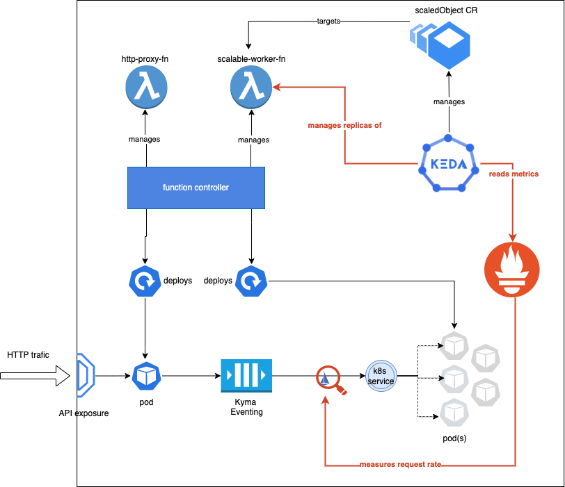

# Keda module

## What is KEDA

Kubernetes-based Event Driven Autoscaler [(KEDA)](https://keda.sh/) is an autoscaler that allows you to easily scale your Kubernetes-based resources. You can scale your applications on the basis of the data of your choice.

Keda supports a great number of scalers that help you manage your deployments. For the complete list, check the KEDA [Scalers](https://keda.sh/docs/scalers/) documentation.

For more information about KEDA features, see [KEDA documentation](https://keda.sh/docs).

## Keda module

Keda module is an extension to Kyma that allows you to install and manage KEDA on your Kubernetes cluster, using Keda Manager.

## Keda Manager

Keda Manager helps you to install and manage KEDA on your cluster. It manages the lifecycle of KEDA based on the dedicated Keda custom resource (CR).

# Keda configuration

This document describes how to configure the Keda module using Kyma CustomResourceDefinition (CRD).
See how to configure the **logging.level** or resource consumption.

- To change the logging level, choose one of the accepted values: `debug`, `info`, or `error`. For example:

   ```yaml
   spec:
     logging:
       operator:
         level: "debug"
   ```
- Change the operator and metricServer resource consumption using your preferred values. For example:

   ```yaml
     resources:
       operator:
         limits:
           cpu: "1"
           memory: "200Mi"
         requests:
           cpu: "0.5"
           memory: "150Mi"
       metricServer:
         limits:
           cpu: "1"
           memory: "1000Mi"
         requests:
           cpu: "300m"
           memory: "500Mi"
   ```
For more information about the Keda resources, visit the [Keda concepts](https://keda.sh/docs/latest/concepts/) documentation.

# Keda module footprint

The Keda module consists of four workloads.
Two of them, `keda-manager` and `keda-operator`, implement the Kubernetes operator pattern and consume extra resources only when they detect changes in the resources they watch, for example, Keda CR, ScaledObject CR, etc. Usually, they are idle and consume as little as few millicores of CPU time and less than 30MB of memory. At the time of active reconciliation, the observed CPU time jumps to 5m.

Similarly to the operators, the `keda-admission-webhooks` workload stays idle most of the time and performs validation operations only when you submit a new object from `*.keda.sh` API group.

The last workload, `keda-operator-metrics-apiserver`, continuously serves metrics for the Kubernetes autoscaling components. Here, the consumption is the highest, but in the case of one or two active KEDA scalers, it stays at 5-7 millicores of CPU time.


| Name                            | CPU (cores) | Memory (bytes) |
|---------------------------------|-------------|----------------|
| keda-admission-webhooks         | 1m          | 10Mi           |
| keda-manager                    | 3m          | 23Mi           |
| keda-operator                   | 3m          | 26Mi           |
| keda-operator-metrics-apiserver | 5m          | 30Mi           |

# Demo applications

## CPU scaler example

### Context
This demo application shows how to scale the Kubernetes workloads using KEDA API based on a simple CPU consumption case.

See the KEDA documentation:
 - [API of Scaled Object Custom Resource](https://keda.sh/docs/latest/concepts/scaling-deployments/#scaledobject-spec)
 - [Available scalers](https://keda.sh/docs/latest/scalers/)

The KEDA demo application consists of:
 - order-service deployment (serving as a scale target)
 - busybox deployment (generating trafic)
 - scaled object using a simple CPU-based trigger

### Procedure

1. Deploy the demo application:

```bash
kubectl apply -f examples/keda-cpu-scaler-demo.yml
```

2. Verify the successful deployment of the demo application:

You should see that scaled object is created and has a status READY:

```bash
kunectl get scaledobjects.keda.sh -n keda-demo
NAME                        SCALETARGETKIND      SCALETARGETNAME   MIN   MAX   TRIGGERS   AUTHENTICATION   READY   ACTIVE   FALLBACK   AGE
orders-service-cpu-scaler   apps/v1.Deployment   orders-service    1     10    cpu                         True    True     Unknown    8m3s
```

You should also see that after a while, KEDA has engaged the Kubernetes HorizontalPodAutoscaler, which controls the number of replicas of the target deployment.

```bash
kubectl get hpa -n keda-demo
NAMESPACE   NAME                                 REFERENCE                   TARGETS   MINPODS   MAXPODS   REPLICAS   AGE
keda-demo   keda-hpa-orders-service-cpu-scaler   Deployment/orders-service   80%/30%   1         10        4          31s
```

## Prometheus scaler example

Follow [this example](https://github.com/kyma-project/examples/tree/main/scale-to-zero-with-keda) to experience how Kyma's Keda module can complement other Kyma components.

It demonstrates an event-driven approach that allows you to decouple functional parts of an application and apply consumption-based scaling.

It uses: 
 - Functions to deploy workloads directly from a Git repository ([Kyma Serverless](https://kyma-project.io/docs/kyma/latest/01-overview/serverless/)),
 - In-cluster Eventing to enable event-driven communication ([Kyma Eventing](https://kyma-project.io/docs/kyma/latest/01-overview/eventing/)), 
 - Prometheus and Istio to deliver metrics essential for scaling decisions,
 - Keda to drive the scaling.



# Keda CR conditions

This section describes the possible states of the Keda CR. Two condition types, `Installed` and `Deleted`, are used.

| No | CR State   | Condition type | Condition status | Condition reason    | Remark                               |
|----|------------|----------------|------------------|---------------------|--------------------------------------|
| 1  | Ready      | Installed      | true             | Verified            | Server ready                         |
| 2  | Processing | Installed      | unknown          | Initialized         | Initialized                          |
| 3  | Processing | Installed      | unknown          | Verification        | Verification in progress             |
| 4  | Error      | Installed      | false            | ApplyObjError       | Apply object error                   |
| 5  | Error      | Installed      | false            | DeploymentUpdateErr | Deployment update error              |
| 6  | Error      | Installed      | false            | VerificationErr     | Verification error                   |
| 7  | Error      | Installed      | false            | KedaDuplicated      | Only one instance of Keda is allowed |
| 8  | Deleting   | Deleted        | unknown          | Deletion            | Deletion in progress                 |
| 9  | Deleting   | Deleted        | true             | Deleted             | Keda module deleted                  |
| 10 | Error      | Deleted        | false            | DeletionErr         | Deletion failed                      |

